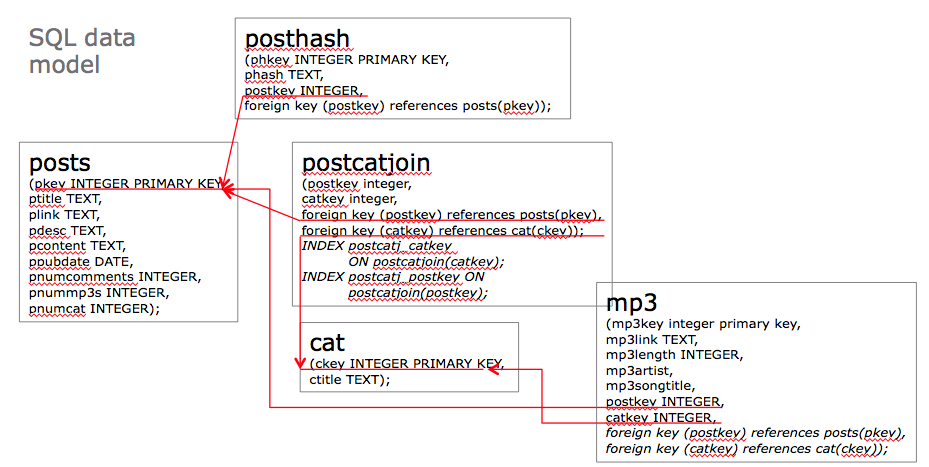
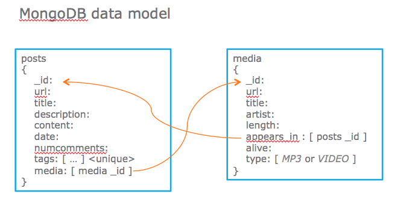

# Mongo experiments #1

I'm translating an old sqlite3-based data model in to MongoDB so that I can use it for further experiments:
* Query it in MongoLab DBaaS
* Build an app around it to CRUDE the data via REST

Here is the old data model:

Here is the new data model:

Here is the (yet-to-be) app stack:
 app stack")

